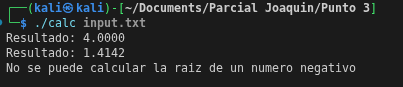

# Uso de bison y Flex para calcular la raiz cuadrada de un real
## Definimos las reglas sintaxicas con flex
```bash
%{
#include "calc.tab.h"
#include <stdlib.h>
%}

%%

[0-9]+(\.[0-9]+)?   { yylval.num = atoi(yytext); return NUM; }
"sqrt"              { return SQRT; }
\n                  { return EOL; }
[ \t]               {}
.                   { return yytext[0]; }

%%

int yywrap() { return 1; }
```
Definimos las reglas gramaticales de bison

```bash
%{
#include <stdio.h>
#include <math.h>
#include <stdlib.h>

void yyerror(const char *s);
int yylex();
extern FILE *yyin;
%}

%union {
    double num;
}

%token <num> NUM
%token SQRT
%token EOL

%type <num> expr

%%

input:
    | input line
    ;

line:
    expr EOL   { printf("Resultado: %.4f\n", $1); }
    | EOL
    ;

expr:
    NUM                  { $$ = $1; }
    | SQRT '(' expr ')'  { 
                            if ($3 < 0) {
                                $$ = 0;
                            } else {
                                $$ = sqrt($3);
                            }
                         }
    ;

%%
void yyerror(const char *s) {
  printf("No se puede calcular la raiz de un numero negativo o incluir caracteres no valido");
}

int main(int argc, char **argv) {
    if (argc != 2) {
        printf("Ingrese un archivo");
        exit(1);
    }

    FILE *f = fopen(argv[1], "r");
    if (!f) {
        perror("No se pudo abrir el archivo");
        exit(1);
    }

    yyin = f;
    yyparse();
    fclose(f);
    return 0;
}

```
De este modo podemos definir la estructura de los numeros reales (doubles).
Cada input puede ser una o varias lineas, cada linea esta definida por una expresion y un fin de linea,
El modo en que calcula la expresion, es que verifica que halla un numero seguido de un parentesis seguido de la palabra reserva sqrt, verifica si el numero es negativo en la parte de errores, si es, no hace la operacion de raiz cuadrada.

## Input
```bash
sqrt(16)
sqrt(2.25)
sqrt(d)

```

## Output

