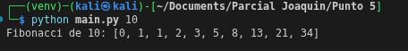

## Generacion de fibonacci 
Utilizando la gramatica de antlr4, expresamos una regla que permita el ingreso de un entero, o podemos escribir de manera natural fibo ( INT )

El eval visitor se encarga con esta funcion hacer la recursividad de fibonacci:
```bash
def visitFiboExpr(self, ctx:FiboParser.FiboExprContext):

        n = int(ctx.INT().getText())
        return self.fibonacci(n)

    def fibonacci(self, n):
        if n <= 0:
            return []
        elif n == 1:
            return [0]
        elif n == 2:
            return [0, 1]

        seq = [0, 1]
        for i in range(2, n):
            seq.append(seq[-1] + seq[-2])
        return seq
```

La forma de ejecutarlo es:
```bash
python main.py 10
```

Con ese output tenemos:


